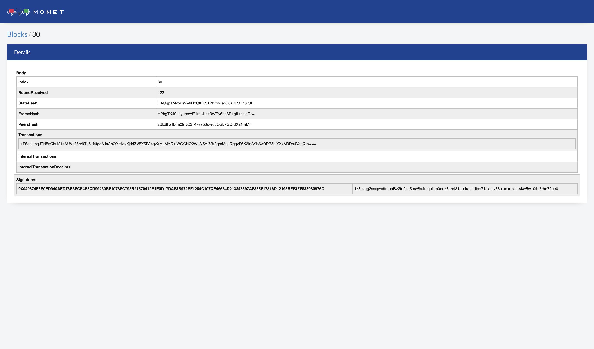
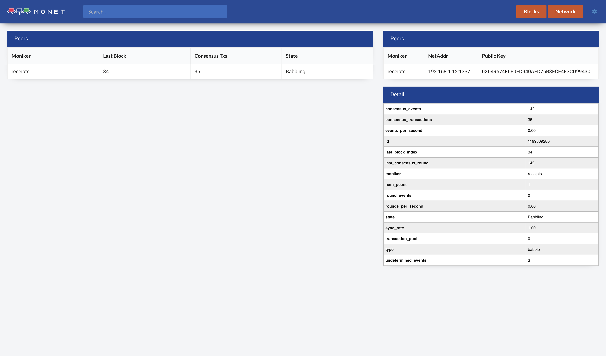

# Monet Explorer

The Monet Dashboard.

## Setting Up

Download or clone this repository then simply run

```bash
$ npm install
```

Once that has finished to run the react developement server

```bahs
$ npm run dev
```

## Preview




